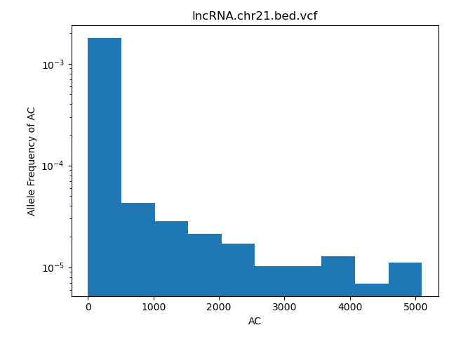

#QBB2022 - Day 4 Lunch - Exercises Submission

1. 
The output file "exons.chr21.bed.vcf" reports 1107407 bp. Output file "processed_pseudogene.chr21.bed.vcf" reports 956640 bp. Output file "protein_coding.chr21.bed.vcf" reports 13780687 bp.

Strategies to confirm the reproduced plots are the same as in the cache/ directory: We could open the plots that we reproduced and the plots in the cache/ directory and compare them to see if they look the same. We could also use the command line and write code that could compare the files, such as reproduced plot == cache plot. We could run the code and see if the plots are identical.

One gene type that I find interesting is the unprocessed pseudogene, because they all mostly seem to be exons so I would be interested to know what each gene does. Another gene type I find interesting is the transcribed processed pseudogene because I would want to see the difference between the unprocessed and processed pseudogenes and if they have the same functions. Another gene type that I find interesting is the protein coding genes because I want to see their role in the organism.

2.
The trends that I saw in the plots were that at the beginning of each plot, there was a very high AC value, but in each of the plots the AC values dropped severely very quickly, and overall maintained much lower AC values compared to the beginning of the plots. I think this trend means that in the populations of the individuals, lower AC values have a higher frequency in the population.

3.
SYNOPSIS
bxlab/cmdb-plot-vcfs was used to create plots representing the varied allele frequencies in different genotypes. The data was taken from large populations of individuals.


USAGE
bash do_all.sh
random_snippet.vcf
gencode.v41.annotation.gtf.gz


DEPENDENCIES
Needed softwares are Conda version 4.13.0, Python version 3.9.7.final.0, git version 2.34.1, bedtools version 2.30.0, matplotlib version 3.5.1, and numpy version 1.22.3


DESCRIPTION
1. Create .bed files for features of interest
-run subset_regions.sh bash script
2. Create .vcf files for each feature of interest
3. Make plots
-python plot_vcf_ac.py

OUTPUT
```
*** Creating .bed files for features of interest
--- Creating lncRNA.chr21.bed
--- Creating exons.chr21.bed
*** Subsetting .vcf for each feature
--- Subsetting exons.chr21.bed.vcf
    + Covering 1107407 bp
--- Subsetting lncRNA.chr21.bed.vcf
    + Covering 8663528 bp
--- Subsetting processed_pseudogene.chr21.bed.vcf
    + Covering 956640 bp
--- Subsetting protein_coding.chr21.bed.vcf
    + Covering 13780687 bp
*** Plotting AC for each .vcf
--- Plotting AC for exons.chr21.bed.vcf
--- Plotting AC for lncRNA.chr21.bed.vcf
--- Plotting AC for processed_pseudogene.chr21.bed.vcf
--- Plotting AC for protein_coding.chr21.bed.vcf
--- Plotting AC for random_snippet.vcf
```
